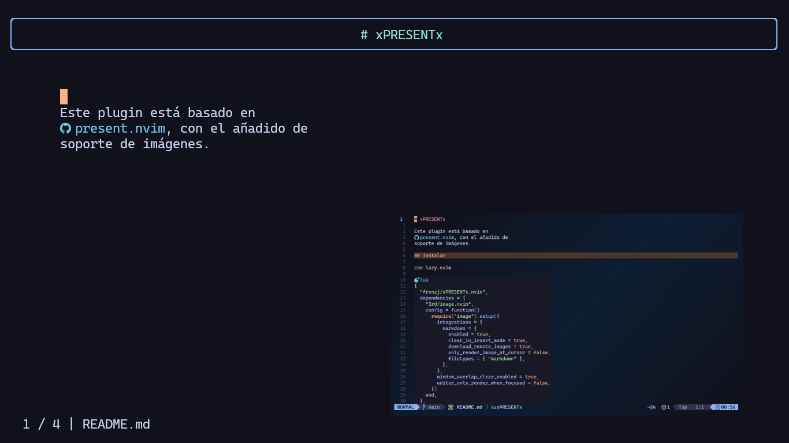

# xPRESENTx

Este plugin está basado en
[present.nvim](https://github.com/tjdevries/present.nvim),
con el añadido de soporte de imágenes.



## Instalar

con **lazy.nvim**

```lua
{
  "frvnzj/xPRESENTx.nvim",
  dependencies = {
    "3rd/image.nvim",
    config = function()
      require("image").setup({
        integrations = {
          markdown = {
            enabled = true,
            clear_in_insert_mode = true,
            download_remote_images = true,
            only_render_image_at_cursor = false,
            filetypes = { "markdown" },
          },
        },
        window_overlap_clear_enabled = true,
        editor_only_render_when_focused = false,
      })
    end,
  },
}
```

### Dependencies

- Terminal con soporte de imágenes (kitty, WezTerm, ghostty)
- image.nvim

## Funcionamiento

Para iniciar la presentación `:XpresentXStart`, cambiar a la diapositiva
siguiente `n`, diapositiva anterior `p`. Para terminar la presentación `q`. La
ejecución de codeblocks —lua, python, javascript— con la tecla `X`. Para mayor
referencia de configuración vease
[present.nvim](https://github.com/tjdevries/present.nvim).

La imágenes se muestran en la parte derecha, con la tecla `I` la
imagen se abre en grande, para cerrar `:q<cr>`. Recomiendo, antes de iniciar la
presentación, setear el textwidth del buffer a 50 y formatear el texto para que
la presentación tenga una mejor disposición del texto a la izquierda y las
imágenes a la derecha:

`:set textwidth=50`

después selecciona el párrafo del slide que contiene imágenes y presiona `gw`.

### Slides

Si un header tiene mucha información, puedes dividir la sección en diversos
slides usando un comentario para separa: `<!-- slide -->`
